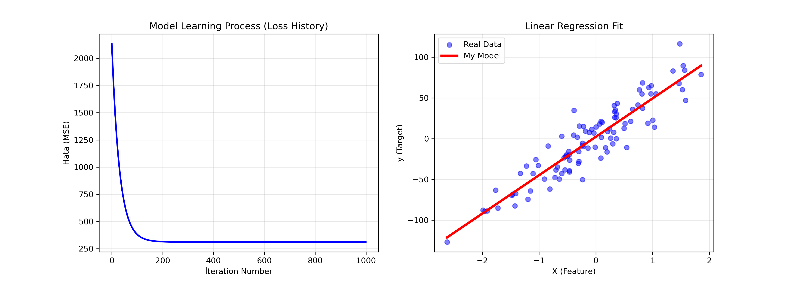

# Linear Regression from Scratch 🚀

A robust implementation of **Linear Regression** using **Gradient Descent**, built entirely from scratch using Python and NumPy. This project demonstrates the mathematical underpinnings of machine learning algorithms without relying on high-level frameworks like Scikit-Learn for the core logic.

## 📊 Results

| Loss History | Model Fit |
|:---:|:---:|
|   |

*The model successfully converges and matches the performance of Scikit-Learn's implementation.*

## 🧠 Mathematical Background

The model minimizes the **Mean Squared Error (MSE)** cost function:

$$J(w, b) = \frac{1}{N} \sum_{i=1}^{N} (y_i - (w \cdot x_i + b))^2$$

Optimization is performed via **Gradient Descent** with the following update rules:

$$w = w - \alpha \cdot \frac{\partial J}{\partial w}$$
$$b = b - \alpha \cdot \frac{\partial J}{\partial b}$$

## 🛠 Features

- **Custom Fit:** Implements gradient descent iterations manually.
- **Vectorized Operations:** Uses NumPy for efficient matrix multiplications.
- **Loss Tracking:** Visualizes the training process and convergence.
- **Scikit-Learn API Style:** Mimics the familiar `.fit()` and `.predict()` methods.

## 💻 Usage

```python
from src.linear_regression import LinearRegression
import numpy as np

# 1. Initialize Model
model = LinearRegression(learning_rate=0.01, iterations=1000)

# 2. Train
model.fit(X_train, y_train)

# 3. Predict
predictions = model.predict(X_test)